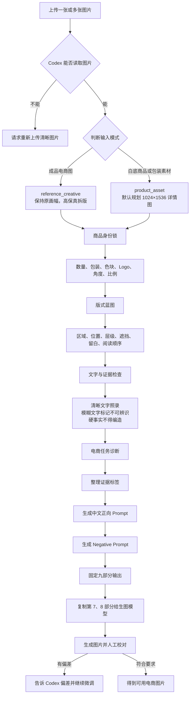

# 从一张图片到 Prompt：零基础使用指南

这份指南不要求你会写代码。你只需要会两件事：上传图片，然后输入一句话。

## 一句话理解这个 Skill

`ecom-image-to-prompt` 像一位“电商视觉拆解师”。

你给它一张图片，它不会只说“画面里有一个妈妈、一个孩子和一个商品”，而会继续拆出：

- 这是一张生活照片，还是完整电商海报；
- 商品有几个，包装是什么形状、颜色和比例；
- 标题、价格、卖点、人物、商品和证明分别放在哪里；
- 哪些文字确实看得清，哪些不能确认；
- 重新生成时，正向 Prompt 应该怎么写；
- 为了防止商品变形、数量出错，还要禁止什么。

最后得到的是一份可以交给生图模型执行的“施工图”，不是一段泛泛的摄影描述。

## 谁负责什么

| 角色 | 可以理解成 | 负责什么 |
|---|---|---|
| 你 | 需求方 | 上传图片，说明想拆解还是复刻 |
| Codex | 会看图的设计助理 | 读取图片，执行 Skill 规则 |
| 本 Skill | 标准作业手册 | 规定先看什么、不能编造什么、如何输出 |
| 生图模型 | 执行设计稿的画师 | 使用最终 Prompt 生成图片 |

重要：本 Skill 只负责看图、拆图和写 Prompt，不会自动生成图片。

## 完整链路图



## 第 1 步：读取图片

Codex 先确认图片是否存在、是否看得清。

- 没有图片：只会请你上传，不会凭空编 Prompt。
- 图片模糊：继续分析能确认的部分，把其余内容标成“不确定”。
- 多张图片：默认第 1 张是版式参考，后续是商品、包装、Logo 或证明素材。

## 第 2 步：判断输入模式

### `reference_creative`：成品电商图

适合电商主图、促销海报、详情页、卖点图、对比图、步骤图和信任背书图。

重点是高保真复刻：保持原画幅、信息密度、商品位置和阅读顺序。

### `product_asset`：纯商品素材

适合白底商品图、透明素材、包装图和 Logo。因为没有现成版式，Skill 会规划一张新详情图，默认尺寸是 `1024×1536`。

缺少信息时会保留占位符：

```text
[待确认：主标题]
[待确认：核心卖点]
[待确认：证明材料]
[待确认：价格/优惠]
```

它不会为了让文案完整而随便编造功效。

## 第 3 步：建立商品身份锁

很多生图失败不是因为光线不好，而是商品被模型改了：一个包装变成三个纸盒，条袋变成礼袋，Logo 被重写，甚至多出赠品。

所以 Skill 会优先锁定：

| 检查项 | 例子 |
|---|---|
| 商品数量 | 一个外包装，加多条独立条袋 |
| 包装形态 | 圆角立式软包装，不是纸盒 |
| 主色与色块 | 上部黄色、下部深蓝 |
| Logo | 可见品牌文字、位置和大小 |
| 角度 | 正面、侧面、45 度或手持 |
| 比例 | 商品相对人物、手掌和画面的大小 |
| 不可修改项 | 轮廓、色块、Logo、吉祥物 |
| 不确定项 | 被遮挡数量、看不清的小字 |

## 第 4 步：拆出版式蓝图

Skill 会把画面当作一个坐标系统，记录：

- 顶部、中部、底部分别占多少；
- 标题、价格、人物和商品在左、中、右哪个位置；
- 谁挡住谁，什么必须在最前面；
- 哪里需要留白；
- 用户第一眼、第二眼、第三眼看什么。

因此，它不会把一张高信息密度的海报误写成“温馨家庭摄影”。

## 第 5 步：抄录文字，但不猜文字

Skill 会逐项记录品牌、标题、副标题、价格、数量、卖点、包装文字、认证和底部证明栏。

规则很简单：

- 看得清：原样记录；
- 看不清：写“不可辨识”；
- 你明确提供：标记为 `User-provided`；
- 只根据经验猜到：不能当成事实。

价格、功效、认证、股票代码、销量、评价和检测数据尤其不能自行补写。

## 第 6 步：判断图片的转化任务

它会判断这张图主要负责什么：吸引注意、解释卖点、建立信任、展示场景、进行对比、教授步骤，还是传达价格优惠。

这个判断决定最终 Prompt 中什么元素应该最大、最醒目。

## 第 7 步：给信息贴上证据标签

| 标签 | 意思 |
|---|---|
| `Visible` | 图片中清楚可见 |
| `User-provided` | 你明确提供 |
| `Inferred` | 根据画面做出的合理推断 |
| `Default` | Skill 使用的默认设置 |
| `Needs confirmation` | 看不清、被遮挡、冲突或缺失 |

这让你能区分“真的看到了”和“为了继续工作做出的推断”。

## 第 8 步：生成正向 Prompt

正向 Prompt 会依次写明：

1. 作品类型和任务；
2. 画幅；
3. 版式区域；
4. 商品身份锁；
5. 清晰文字及其位置；
6. 人物、动作和场景；
7. 光线、材质和商业质感；
8. 不可省略的区域；
9. 不得改变的商品细节。

面对成品复合海报时，它会明确写：

```text
完整电商信息海报，不是纯摄影
```

这是为了阻止模型只生成漂亮的生活照片，却丢掉标题、价格和证明栏。

## 第 9 步：生成 Negative Prompt

Negative Prompt 专门禁止常见错误，例如：

- 把电商海报变成生活方式摄影；
- 重设计包装或修改 Logo；
- 改变商品数量；
- 把软包装改成纸盒、礼盒或手提袋；
- 让人物占满画面；
- 省略标题、价格、卖点或底部证明栏；
- 出现随机文字、虚构认证或额外商品。

正向 Prompt 是施工要求，Negative Prompt 是禁止事项。两者一起使用更稳定。

## 最终输出什么

每次固定返回九个部分：

1. 识别模式与图片类型；
2. 电商任务诊断；
3. 商品身份锁；
4. 版式蓝图；
5. 文字清单；
6. 证据与假设；
7. 最终中文正向 Prompt；
8. Negative Prompt；
9. 生成提醒。

你真正交给生图模型的是第 7 和第 8 部分；前六部分用来检查它有没有理解错图。

## 用母婴营养品海报举例

假设图片包含母子、黄色蓝色包装、价格、奖杯和底部证明栏。

普通描述可能只有：

```text
一位妈妈和孩子在温暖的家中互动，桌上摆放营养品，商业摄影风格。
```

这样生成出来的往往是一张温馨照片，标题、价格、包装结构和证明栏全没了。

本 Skill 会识别：

- 它是“促销 + 卖点 + 场景 + 信任背书”的复合海报；
- 顶部是标题和卖点，右上是价格和数量；
- 中下部是母子、一个黄蓝大包装和多条独立条袋；
- 右侧有奖杯，底部有证明栏；
- 人物只是情绪入口，商品和商业信息才是成交主体；
- 如果条袋被遮挡，就写“多条，精确数量无法确认”。

这就是“描述画面”和“拆成可执行设计规格”的区别。

## 第一次使用：照着做

### 1. 安装

在 Codex 中输入：

```text
请使用 $skill-installer 安装这个 Skill：
https://github.com/willson-wen/ecom-image-to-prompt/tree/main/skills/ecom-image-to-prompt
```

安装完成后重启 Codex。

### 2. 上传图片并启动

把图片拖进 Codex，然后输入：

```text
使用 $ecom-image-to-prompt 分析我上传的图片，输出完整拆版规格、正向 Prompt 和 Negative Prompt。
```

### 3. 检查前六部分

重点确认商品数量、包装形态、Logo、颜色、价格、文字和版式是否正确。

### 4. 使用 Prompt 生图

复制第 7 和第 8 部分，交给你的生图模型。如果继续在 Codex 生图，可以另外说：

```text
请使用 imagegen，根据上面的正向 Prompt 和 Negative Prompt 生成图片，并把我上传的商品图作为商品身份参考。
```

### 5. 对照原图校对

按顺序检查：商品身份、数量、包装、版式、中文、人物比例、价格和证明材料。发现偏差就明确告诉 Codex 哪一项错了，再修改 Prompt 或编辑图片。

## 多张图片怎么上传

默认第 1 张是版式参考，后续图片用于锁定商品、包装、Logo 或证明。可以这样说：

```text
图1是版式参考，图2是准确商品包装，图3是品牌 Logo。
使用 $ecom-image-to-prompt 拆解，并以图2锁定商品身份。
```

## 常见问题

### 它会自动生成图片吗？

不会。它输出拆版规格和 Prompt，生图是下一步任务。

### 需要 API Key 吗？

第一版不需要。它直接使用 Codex 当前对话的图片理解能力。

### 为什么中文仍可能写错？

生图模型对密集中文和包装小字仍不稳定。Skill 能提供正确文字和位置，但成图后仍需人工校对。

### 图片太糊怎么办？

重新上传原图、商品包装正面图或局部高清截图。无法确认的文字不会被编造。

### 只有白底商品图能用吗？

可以。它会进入 `product_asset` 模式，默认规划一张 `1024×1536` 详情图。

## 一句话速记

```text
上传图片 → 判断模式 → 锁定商品 → 拆解版式 → 抄录文字 → 区分证据 → 写正向 Prompt → 写 Negative Prompt → 生图 → 人工校对
```
